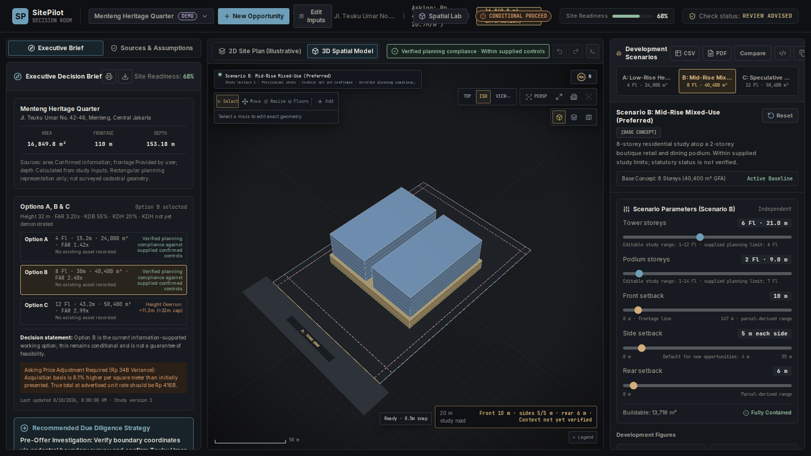
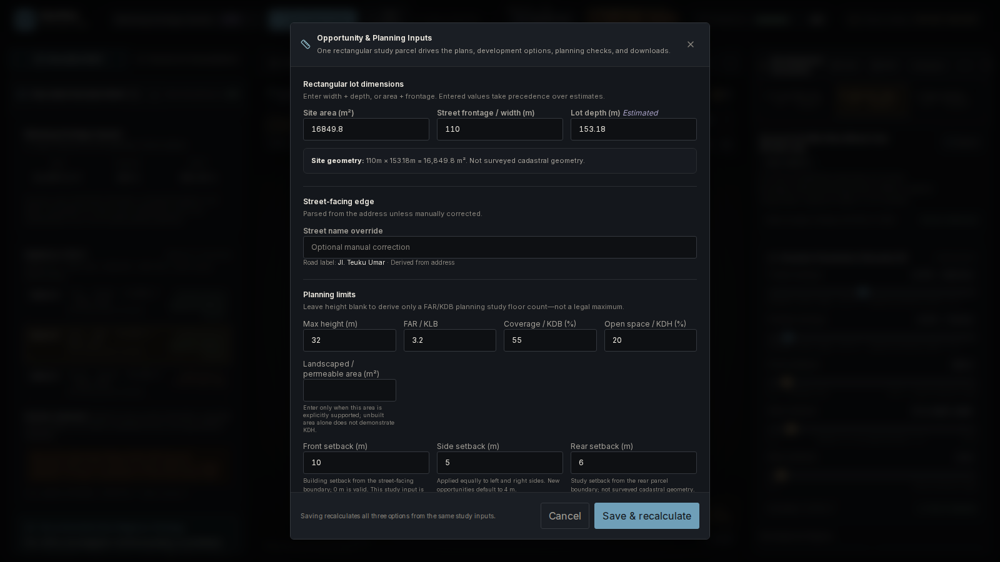
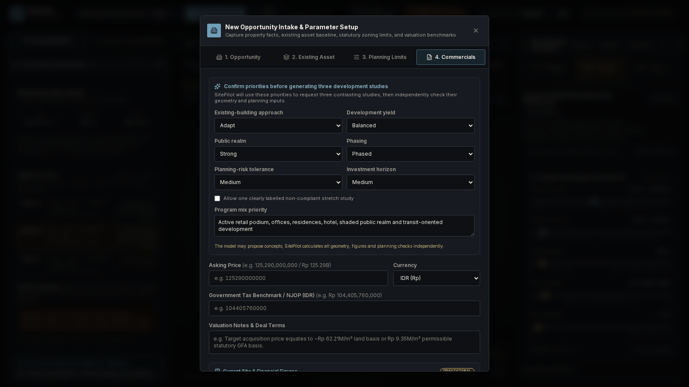
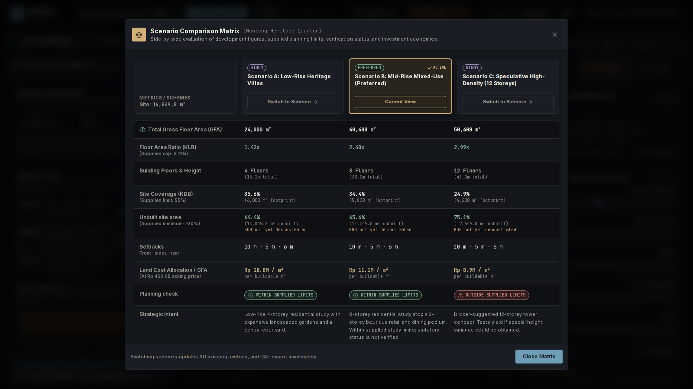
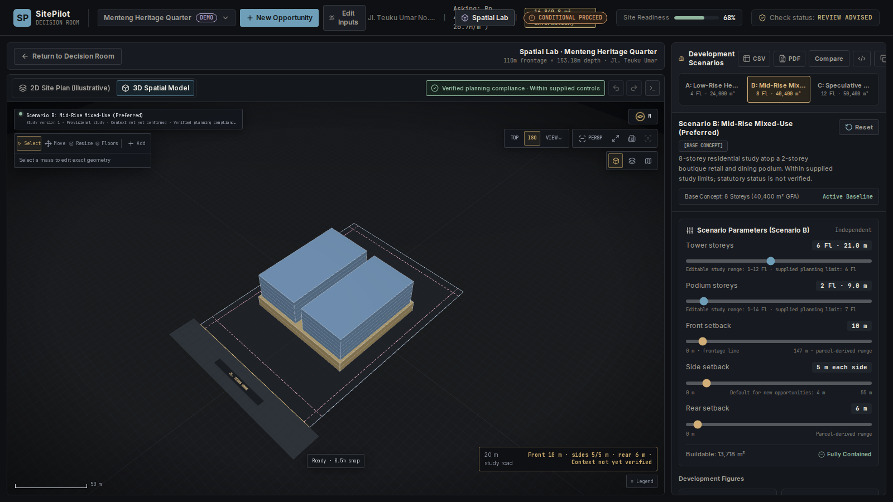
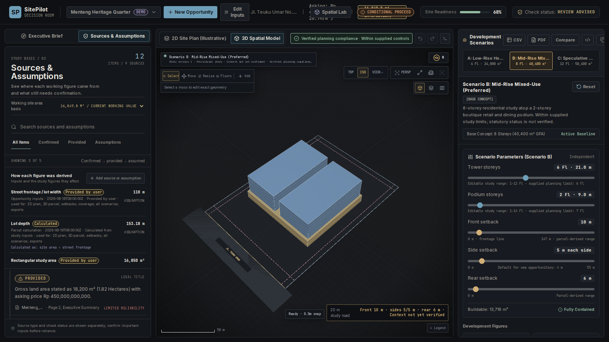
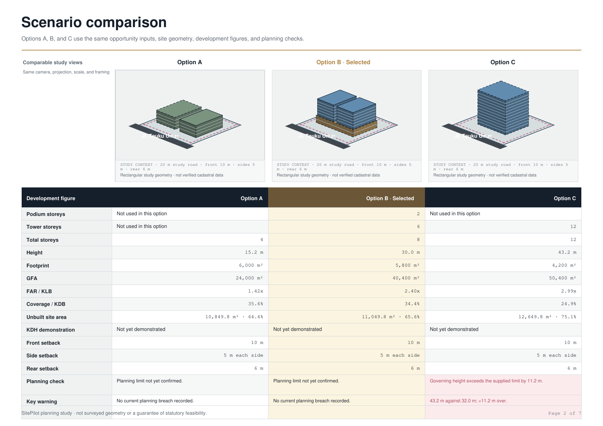
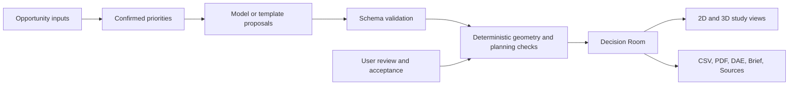

# SitePilot — Better Places Begin With Better Questions

SitePilot helps teams turn early property information, planning limits, and development goals into comparable spatial studies before committing to a direction.

**[Open the live testing build](https://sitepilot-hackathon.vercel.app)**
**Draft Final — available for continued testing**



> This is a feature-branch testing build. It is not merged to `main`, promoted to Production, or submitted to the hackathon.

## The problem

Important development decisions begin with incomplete information. Site area, planning controls, existing assets, investment criteria, and spatial consequences are often reviewed in separate documents and tools. Teams need to compare credible alternatives while keeping assumptions, source status, and missing information visible.

SitePilot brings those early decisions into one reviewable study. It is designed for urban designers, planners, architects, development managers, investors, and technical reviewers who need a clear conversation about what is known, what is calculated, and what still needs confirmation.

## What SitePilot does

The verified Release 1 workflow is:

1. Create an opportunity.
2. Record the site, existing asset, planning limits, and commercial criteria.
3. Generate or create three contrasting development studies.
4. Check each study against supplied FAR/KLB, KDB, KDH, height, and setback inputs.
5. Explore the rectangular study parcel in 2D and in the 3D Spatial Console.
6. Compare Options A, B, and C without changing the accepted study state.
7. Review sources, assumptions, and information still needed.
8. Export the accepted study as CSV, PDF, and metre-scale `Z_UP` DAE.

The geometry engine, planning figures, comparison views, Executive Brief, Sources & Assumptions, and exports all read the same accepted study state. The Spatial Console is a representation of that state; it does not calculate an independent version of planning truth.

## Three-scheme workflow

The New Opportunity flow asks the user to confirm priorities before preparing three studies, including existing-asset approach, development yield, public realm, program mix, phasing, planning-risk tolerance, investment horizon, and whether a clearly labelled stretch study is allowed.

The committed application includes a structured proposal path through `@google/genai`. In the verified local build no provider credentials were configured, so the UI honestly labels the result **Study templates—not model-generated**. The configured release identifier is `gemini-3.7-flash`; live paid inference must still pass the hosted acceptance gate before promotion. When a permitted provider is configured, the server returns the provider and model metadata with the proposals rather than implying a model call that did not happen.

The boundary is deliberate:

> The model proposes development strategies; SitePilot calculates and checks the resulting geometry.

Each proposal is schema-validated and independently checked before it can be accepted for editing. The user reviews and accepts a proposal; acceptance, not model prose, determines the active study state. Invalid or incomplete proposals are rejected or replaced by an explicitly labelled fallback.

## Development-study strategies

The three current study theses are intentionally different:

- **Option A — Adaptive / lower risk:** retain or adapt the recorded existing asset where requested, protect public-realm headroom, and keep a more conservative delivery and planning position.
- **Option B — Balanced mixed-use:** combine a clear podium-and-tower arrangement with a balanced yield, public-realm, program, and phasing story.
- **Option C — Boundary study:** approach the supplied FAR/KLB, KDB, height, and setback envelope to expose available headroom and risk. It does not silently exceed a supplied limit, and a non-compliant stretch alternative is only allowed when the user enables it.

The existing asset baseline is shown separately as a reference. A scheme states whether it retains, partially retains, adapts, or replaces that asset; geometry and narrative are not allowed to claim operational continuity when the massing says otherwise.

## Key capabilities

- Opportunity intake with rectangular study parcel dimensions: area, frontage, and depth.
- Front, side, and rear study setbacks, including a valid `0 m` front setback and symmetric side setbacks.
- A 20 m study road and street-name context derived from the address or a manual correction.
- Existing-asset representation and explicit retention, adaptation, partial-retention, or replacement strategy.
- Development scenarios with independent tower and podium storey controls.
- A light transparent planning-envelope study volume when a height limit is supplied.
- FAR/KLB, KDB, KDH, height, containment, collision, and setback checks based on accepted study inputs.
- Undo, redo, browser-local persistence, scenario switching, and reload-safe study revisions.
- Executive Brief and read-only **Sources & Assumptions** views.
- CSV, seven-page A4 landscape PDF, and metre-scale `Z_UP` DAE exports.
- Spatial Console as the default renderer, with explicit `legacy` override and tested initialization fallback.

## Screenshot walkthrough

### Decision Room overview

The main workspace keeps the opportunity summary, planning checks, 2D/3D views, scenarios, and editing controls in one decision surface.


### Opportunity intake

The intake records a rectangular study parcel, existing asset facts, planning limits, commercial context, and their source status before a scheme is prepared.



### Priorities and proposal preparation

The synthetic local flow confirms development priorities and discloses that, without configured credentials, the three studies are templates rather than model-generated proposals.



### Three-scheme comparison

The comparison matrix keeps the three options aligned while showing development figures, setbacks, planning checks, and strategic intent.



### Spatial Console

The 3D view shows the study parcel, road, setbacks, transparent envelope, selected massing, scale, north, and current planning-check language.



### Sources & Assumptions

The source view distinguishes information provided by the user, confirmed information, calculations, assumptions, and information still needed.



### Development report

The report compares the three studies with aligned drawings and a transposed development-figure table for review outside the application.



## How it works



The model or fallback proposes; SitePilot calculates and validates; the user accepts; reports and exports use the accepted study state. Model prose does not control geometry, compliance, or export totals, and no hidden reasoning is stored as a product record.

## Technology

The current repository uses:

- Next.js `16.3.1`, React `19.2.8`, and TypeScript.
- Three.js `0.185.1` and SitePilot’s directly managed WebGL Spatial Console renderer.
- Zod for proposal and input validation and Lucide for interface icons.
- `@google/genai` `2.17.1` for the configured assessment/proposal integration. The source supports Gemini API or Vertex AI selection; the local verified build used the labelled no-credentials fallback.
- Vitest, Testing Library, Playwright, TypeScript, and ESLint for verification.
- Vercel for the published testing build. Cloud Run/Vertex AI/Cloud Build configuration remains in the repository, but current hosted Cloud Run health and authenticated inference were not re-verified in this pass.
- Inter and JetBrains Mono, self-hosted at build time through `next/font/google`.

## Run locally

Prerequisites: Node.js 20 or newer and npm.

```bash
npm ci
cp .env.example .env.local   # optional; never add credentials to Git
npm run dev
```

The development server normally uses the Next.js port selection. For a production-style check:

```bash
npm run build
npm start
```

Verification commands:

```bash
npm test
npx tsc --noEmit
npm run lint
```

Relevant environment variables are `GOOGLE_CLOUD_PROJECT`, `GOOGLE_CLOUD_LOCATION`, `GEMINI_MODEL`, `GEMINI_API_KEY`, and `PORT`. Vertex AI is selected when a Google Cloud project is configured; the Gemini API is selected when an API key is configured without a project. With neither configured, local development uses the explicit study-template/heuristic fallback and does not claim live model generation.

The optional `NEXT_PUBLIC_SPATIAL_EDITOR_ENGINE` flag selects `spatial-console` or `legacy`. When it is unset, Spatial Console is the source default. An invalid explicit value or Spatial Console initialization/synchronization failure falls back to the legacy renderer; the two renderers are mutually exclusive.

## Verification

The latest verified candidate at the current worktree revision reports:

- **Tests:** 23 test files, 168 tests passed with `npm test -- --run`.
- **Typecheck:** `npx tsc --noEmit` passed.
- **Lint:** passed; the full lint output contains warnings only in excluded prototype/verification material.
- **Production build:** `npm run build` passed with the scheme-generation route included.
- **Browser acceptance:** local production runtime returned HTTP 200, mounted one Spatial Console renderer and one canvas, and produced no console, page, or request errors in the smoke pass.
- **Exports:** CSV contained three option rows; PDF rasterized to seven A4 landscape pages; DAE contained metre units and `Z_UP`.
- **Fallback:** explicit legacy renderer and the initialization fallback remain present and tested.

These results describe the local candidate, not a new hosted deployment or a formal hackathon demonstration.

## Current status and limitations

This is **Draft Final — available for continued testing**. Owner and human testing is expected.

- It is not a formal hackathon submission and should not yet be described as an autonomous agent.
- Parcel, road, setback, and envelope geometry are rectangular study representations, not surveyed cadastral or municipal context.
- Planning inputs may be user-provided or unverified. “Within supplied limits” is not a statutory compliance finding.
- Browser-local persistence is useful for exploration but is not account-backed, shareable, or suitable for confidential live cases.
- KDH is shown as not yet demonstrated unless explicit landscaped/permeable area or accepted geometry supports it; unbuilt land alone is not KDH evidence.
- The local screenshot and browser verification used deterministic study templates because live model credentials were not configured. Authenticated, paid model inference and current hosted Cloud Run health remain unverified here.
- Minor responsive and report refinements may remain during continued testing.

For the authoritative submission status, see [`docs/HACKATHON_COMPLIANCE.md`](docs/HACKATHON_COMPLIANCE.md). Deferred product work is recorded in [`docs/PRODUCT_GAPS_AND_NEXT_PHASE.md`](docs/PRODUCT_GAPS_AND_NEXT_PHASE.md).

## Submission and provenance

The project references the [All Things Agentic Hackathon](https://allthingsagentichackathon.devpost.com/), its [official rules](https://allthingsagentichackathon.devpost.com/rules), [FAQ](https://allthingsagentichackathon.devpost.com/details/faqs), and [resources](https://allthingsagentichackathon.devpost.com/resources). Formal eligibility, agentic-workflow readiness, owner attestations, licensing, hosted Google Cloud proof, and the submission video remain separate actions; this README does not claim final rules compliance.

The owner conceived and directed SitePilot and accepted the Spatial Console design. Kimi, Antigravity, and other AI assistants were used under the owner’s direction for design, coding, review, and testing; they are not represented as human contributors or legal co-owners. The production console contains no stock 3D models, imagery, or textures. Third-party packages and fonts remain governed by their own licenses. The repository has no root project license yet; the owner must choose and add one before a final submission.
