# SitePilot — Better Places Begin With Better Questions

SitePilot turns a confirmed development opportunity into three comparable spatial strategies while keeping AI interpretation separate from calculated planning truth.

**[Open the hackathon testing build](https://sitepilot-hackathon.vercel.app)**

> This feature-branch build is not merged to `main` and has not been submitted to the hackathon.


## Current workflow

1. The user records and confirms the site, dimensions, existing asset, development intent, supplied planning inputs, commercial assumptions, priorities, and optional strategy instructions.
2. The private Taskmaster backend persists a run, uses Google ADK with Vertex AI Gemini 3.7 Flash to plan the bounded workflow, and asks Gemini for exactly three structured strategies: Conservative, Balanced, and Boundary.
3. Cloud Tasks delivers the asynchronous worker job and Firestore records the run, events, proposals, simulations, idempotency, correlation, and provider accounting.
4. SitePilot—not Gemini—calculates geometry, achieved GFA, FAR/KLB, KDB, height, setbacks, KDH evidence, collisions, and supplied-envelope status for every proposal.
5. The user reviews the three strategies and must explicitly approve one before it becomes the accepted editable study.
6. On request, Gemini compares all three canonical simulations and prepares a grounded advisory assessment. Deterministic findings remain authoritative.
7. The accepted state powers the Decision Room, 2D plan, 3D Spatial Console, comparison table, Executive Brief, Sources & Assumptions, and CSV/PDF/DAE exports.

If live inference is unavailable or an allowance is exhausted, SitePilot returns clearly labelled template schemes or a deterministic assessment. Fallback never claims that Gemini was called.

## AI authority boundary

Gemini may interpret the confirmed brief, propose strategic intent and structured program/massing parameters, identify trade-offs, and compare server-created evidence. It cannot alter confirmed inputs, canonical geometry, calculated metrics, planning status, persistence, approval state, or exports.

“Within supplied study envelope” is a deterministic study result, not statutory approval. KDH is reported only from explicit landscaped/permeable evidence; residual site area is reported separately.

## Three decision-ready strategies

- **Conservative:** prioritizes asset retention or adaptation, continuity, restrained intervention, lower supplied-envelope risk, and early deliverability.
- **Balanced:** balances achieved yield, public realm, program quality, servicing, phasing, continuity, and planning risk.
- **Boundary:** tests the productive upper edge of the supplied study envelope without inventing permissions or ignoring access, public realm, or operational constraints.

The distinctness gate requires meaningful differences across at least three strategic dimensions. Existing retained and removed GFA must reconcile exactly, program shares must total 100%, and strategic targets remain separate from deterministically achieved results.

## Architecture



- Next.js 16.3.1, React 19.2.8, TypeScript, Zod, Three.js, and the SitePilot Spatial Console.
- Google ADK 2.0.0 and `@google/genai` 2.17.1.
- Vertex AI stable `v1`, location `global`, model exactly `gemini-3.7-flash`, JSON MIME, and server-owned response schemas.
- Private Cloud Run with runtime service-account ADC; no API key or service-account key.
- Cloud Tasks for asynchronous delivery and Firestore for Taskmaster run/event/proposal/simulation durability.
- Vercel server routes invoke private Cloud Run through Vercel OIDC → Google STS → service-account ID-token impersonation. Tokens remain server-only.
- Browser cases remain local to the browser; there is no account-backed project-sharing claim.

Unsupported or deferred product claims include user document upload, three specialist agents, Pub/Sub, Cloud Storage, automated external information requests, statutory approval, financial-return calculation, and final investment Go/No-Go decisions.

## Screens


## Run and verify locally

Requires Node.js 22 or newer.

```bash
npm ci
npm run dev
```

```bash
npm test
npx tsc --noEmit
npm run lint
npm run build
git diff --check
```

Live Vertex inference is server-only and opt-in. Never place Google credentials or model flags in `NEXT_PUBLIC_*` variables. The production architecture uses Cloud Run ADC and private invocation.

## Current limitations and owner gates

- Parcel, street, setback, and context geometry are study representations, not cadastral surveys.
- User-supplied planning and commercial figures remain unverified unless their provenance says otherwise.
- Browser-local case persistence is not account-backed, collaborative, or suitable for confidential production data.
- The public inference path is quota-limited and preserves deterministic fallback.
- The repository has no root project license. The owner must select and add an appropriate license before submission; no license is assumed here.
- Entrant eligibility, project-newness, third-party/AI-provider rights, team details, and final submission attestations remain owner-controlled factual confirmations.
- The demo video and Devpost text are prepared in `docs/` but are not published or submitted.

See [hackathon readiness](docs/HACKATHON_COMPLIANCE.md), the [Devpost draft](docs/DEVPOST_DRAFT.md), and the [four-minute demo plan](docs/DEMO_VIDEO_PLAN.md).

## Provenance

The owner conceived and directed SitePilot. Kimi, Antigravity, Codex, and other AI assistants supported design, implementation, review, and testing under the owner’s direction; they are not represented as human contributors or legal owners. Third-party packages, fonts, and tools remain subject to their own licenses.
