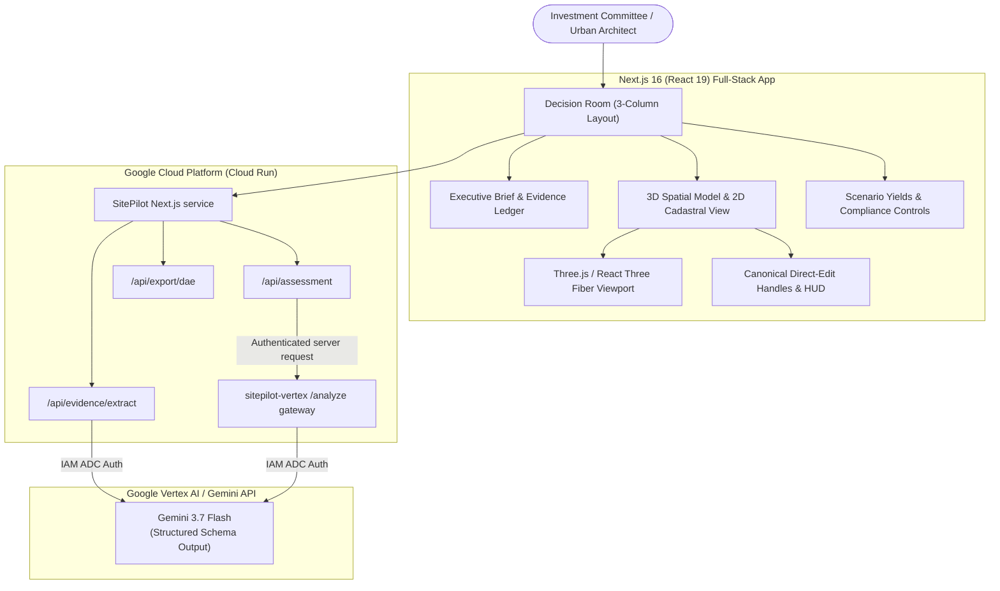

# 🏙️ SitePilot — Intelligent Site Due Diligence & Spatial Decision Room

> **Built for the [All Things Agentic Hackathon](https://allthingsagentichackathon.devpost.com/)**
> *Transforming weeks of fragmented real estate due diligence, zoning bylaws, and manual CAD modeling into an instant, evidence-grounded 3D spatial decision room.*

---

## 🌟 Executive Summary

SitePilot is an AI-powered site intelligence and spatial design workspace for property developers, urban planners, and investment committees. It ingests complex, conflicting property documentation (title deeds, zoning excerpts, broker brochures, and site surveys), extracts traceable facts and claims using **Google Vertex AI** and **Google GenAI SDK**, and recalculates deterministic 3D massing yields, zoning envelopes, setbacks, and building compliance in real-time.



---

## 🚀 Key Features

1. **3D Spatial Development Workspace:** Live WebGL massing canvas with canonical move, resize, floor and exact numeric editing, a direct-manipulation delta HUD (0.5 m grid snap), interactive north indicator, and pairwise collision detection.
2. **Restrained Spatial Camera Bar:** Precision orthographic elevations (`SOUTH`, `NORTH`, `EAST`, `WEST`), plan view (`TOP`), and axonometric view (`ISO`, `RESET`) with spatial height ticks (`+0m`, `+9m`, `+30m`, `+32m`).
3. **2D Cadastral Map View:** Non-colliding SVG plan view with normalized indexed badges (`[1] Podium`, `[2] West Wing`, `[3] East Wing`).
4. **Deterministic Zoning & Geometry Engine:** Pure mathematical computation of Gross Floor Area (GFA), Floor Area Ratio (FAR / KLB), Building Coverage (KDB), open green space (KDH), and Subzone R.9 height limits.
5. **Evidence Ledger & Contradiction Detection:** Classifies property documentation into **FACT**, **CLAIM**, **ASSUMPTION**, and **INFERENCE** with line-item traceability.
6. **Multi-Scenario Comparison & Reset:** Immediate switching between Scenario A (4 Fl), Scenario B (8 Fl Preferred), and Scenario C (12 Fl Height Overrun) with explicit state badges (`[BASE CONCEPT]`, `[USER OVERRIDE]`, `[FITTED TO SETBACK]`).
7. **COLLADA DAE Export:** Full 3D geometric scene export ready for import into Blender, SketchUp, Rhino, or Revit.

---

## 🛠️ Technology Stack

* **Frontend:** Next.js 16.3.1 (React 19.2.8, React DOM 19.2.8, Turbopack, Tailwind CSS 4)
* **3D Graphics & Engine:** Three.js `0.185.1`, React Three Fiber `9.7.0`, React Three Drei `10.7.8`, Turf.js `7.4.0`
* **Pascal Framework:** `@pascal-app/core` `0.9.2`, `@pascal-app/viewer` `0.9.2`, `@pascal-app/nodes` `0.1.1`
* **AI & Agent Framework:** Google GenAI SDK (`@google/genai` v2.17.1)
* **Configured AI Model:** Google Vertex AI (`gemini-3.7-flash`)
* **Cloud Infrastructure:** Google Cloud Run, Google Artifact Registry, Google Cloud Build, Google Cloud Logging
* **Testing & Quality:** Vitest `4.1.10`, Testing Library React `16.3.2`, ESLint 9

---

## 💻 Local Quickstart

### Prerequisites
* Node.js `>= 20.14.0` (Node 20 or 22 recommended)
* npm `>= 10.0.0`

### Installation & Execution
```bash
# 1. Clone repository
git clone https://github.com/spotty21201/sitepilot.git
cd sitepilot

# 2. Install dependencies
npm ci

# 3. Configure environment variables (optional for local mock mode)
cp .env.example .env.local

# 4. Run automated test suite
npm run test # or: npx vitest run

# 5. Start development server
npm run dev
```
Open [http://localhost:3000](http://localhost:3000) (or `http://localhost:3005`) to view the application.

### Spatial renderer release control

`NEXT_PUBLIC_SPATIAL_EDITOR_ENGINE` is an optional build-time flag. When it is unset, SitePilot selects `spatial-console`. Explicit `spatial-console` selects the same renderer; explicit `legacy` activates the retained legacy renderer. Any other explicit value fails closed to legacy, and Spatial Console initialization or synchronization failure also falls back to legacy without mounting both renderers.

---

## 🧪 Testing & Quality Gates

SitePilot enforces strict quality gates across linting, type-checking, and unit/integration tests:

```bash
# Run unit & integration tests (currently 136 tests across 21 files)
npx vitest run

# Run full-codebase ESLint
npx eslint src/

# Run Next.js production build
npm run build
```

---

## 🐳 Docker Containerization

SitePilot includes a production-grade multi-stage `Dockerfile` optimized for Cloud Run:

```bash
# Build Docker image
docker build -t sitepilot:local .

# Run container locally on port 8080
docker run -p 8080:8080 sitepilot:local

# Check health endpoint
curl http://localhost:8080/api/health
```

---

## ☁️ Google Cloud Deployment

See the comprehensive [Google Cloud Deployment Guide](docs/GOOGLE_CLOUD_DEPLOYMENT.md) for step-by-step instructions on:
1. Setting up Google Cloud IAM with least-privilege service accounts (`sitepilot-runner`).
2. Creating the Artifact Registry repository (`sitepilot-repo`).
3. Deploying via Cloud Build CI/CD (`cloudbuild.yaml`).
4. Configuring Cloud Run scale-to-zero, timeouts, and Vertex AI IAM authentication.

---

## 🏆 Hackathon Compliance & Disclosures

See the [official rules](https://allthingsagentichackathon.devpost.com/rules), [FAQ](https://allthingsagentichackathon.devpost.com/details/faqs), [resources](https://allthingsagentichackathon.devpost.com/resources), and [SitePilot compliance/readiness audit](docs/HACKATHON_COMPLIANCE.md). Source-level required technologies are present, but the current one-shot assessment is not yet a qualifying autonomous agent; submission readiness is conditional on the documented agentic vertical slice and owner attestations.
* **AI Tool Disclosure:** Kimi was used as an AI design/coding assistant under the owner's direction for the SitePilot-specific Spatial Console. Antigravity and other AI coding agents assisted development, review, integration, and testing. See [Spatial Console provenance](docs/SPATIAL_CONSOLE_PROVENANCE.md).
* **Configured Production Path:** Server source uses `@google/genai` with Vertex AI ADC and includes Cloud Run/Cloud Build configuration. This repository snapshot does not by itself prove that a hosted service is currently healthy or that authenticated inference has run.

---

## 📄 License

No root project `LICENSE` file is currently present. The owner must select and add the intended project license before submission. Third-party packages and fonts remain governed by their respective licenses; see [Spatial Console provenance](docs/SPATIAL_CONSOLE_PROVENANCE.md).
