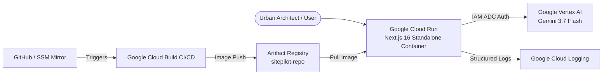

# 🚀 SitePilot Google Cloud Deployment Guide

This guide details the reproducible, production-ready deployment of SitePilot on Google Cloud Platform for the All Things Agentic Hackathon.

---

## 1. Architecture Overview



---

## 2. Prerequisites & CLI Configuration

1. **Google Cloud SDK (`gcloud`):**
   ```bash
   gcloud auth login
   gcloud config set project YOUR_PROJECT_ID
   gcloud config set compute/region asia-southeast2
   ```

2. **Enable Required Google Cloud APIs:**
   ```bash
   gcloud services enable \
     run.googleapis.com \
     cloudbuild.googleapis.com \
     artifactregistry.googleapis.com \
     aiplatform.googleapis.com \
     logging.googleapis.com \
     secretmanager.googleapis.com
   ```

---

## 3. Least-Privilege IAM Setup

Create a dedicated runtime service account for Cloud Run:

```bash
# 1. Create runtime service account
gcloud iam service-accounts create sitepilot-runner \
  --description="Runtime service account for SitePilot Cloud Run service" \
  --display-name="SitePilot Runner"

# 2. Grant Vertex AI User role (for Gemini multimodal inference)
gcloud projects add-iam-policy-binding YOUR_PROJECT_ID \
  --member="serviceAccount:sitepilot-runner@YOUR_PROJECT_ID.iam.gserviceaccount.com" \
  --role="roles/aiplatform.user"

# 3. Grant Cloud Logging Log Writer role
gcloud projects add-iam-policy-binding YOUR_PROJECT_ID \
  --member="serviceAccount:sitepilot-runner@YOUR_PROJECT_ID.iam.gserviceaccount.com" \
  --role="roles/logging.logWriter"
```

---

## 4. Artifact Registry Setup

Create the Docker repository:

```bash
gcloud artifacts repositories create sitepilot-repo \
  --repository-format=docker \
  --location=asia-southeast2 \
  --description="SitePilot container repository"
```

---

## 5. Automated CI/CD Deployment with Cloud Build

Submit the build directly via `cloudbuild.yaml`:

```bash
gcloud builds submit \
  --config=cloudbuild.yaml \
  --substitutions=_REGION=asia-southeast2,_REPO_NAME=sitepilot-repo,_SERVICE_NAME=sitepilot,_SERVICE_ACCOUNT=sitepilot-runner
```

Cloud Build automatically runs:
1. `npm ci`
2. `npx eslint src/` (Zero error gate)
3. `npx vitest run` (100% test pass gate)
4. Multi-stage Docker build
5. Push to Artifact Registry
6. Atomic deployment to Cloud Run

---

## 6. Manual / Direct Cloud Run Deployment

To deploy an already-built container image:

```bash
gcloud run deploy sitepilot \
  --image=asia-southeast2-docker.pkg.dev/YOUR_PROJECT_ID/sitepilot-repo/sitepilot:latest \
  --region=asia-southeast2 \
  --platform=managed \
  --allow-unauthenticated \
  --min-instances=0 \
  --max-instances=2 \
  --memory=1Gi \
  --cpu=1 \
  --timeout=120s \
  --service-account=sitepilot-runner@YOUR_PROJECT_ID.iam.gserviceaccount.com \
  --set-env-vars=GOOGLE_CLOUD_PROJECT=YOUR_PROJECT_ID,GOOGLE_CLOUD_LOCATION=asia-southeast2,GEMINI_MODEL=gemini-3.7-flash,NODE_ENV=production
```

---

## 7. Cost Controls & Production Safety

* **Scale-to-Zero (`--min-instances=0`):** Inactive instances incur zero CPU/memory costs.
* **Concurrency & Max Instances (`--max-instances=2`):** Prevents unexpected billing spikes during testing.
* **Zero Secret Leakage:** Uses Google Cloud Workload Identity / IAM Application Default Credentials. No API keys or service account JSON files are stored in the image or committed to Git.
* **Health Monitoring:** Cloud Run monitors `GET /api/health` for container liveness.

This guide documents repository configuration only. It does not assert that a deployment is currently healthy or that authenticated inference was executed during release consolidation.

---

## 8. Rollback Procedure

To roll back to a previous healthy revision instantly:

```bash
# List revisions
gcloud run revisions list --service=sitepilot --region=asia-southeast2

# Route 100% traffic to previous revision
gcloud run services update-traffic sitepilot \
  --region=asia-southeast2 \
  --to-revisions=PREVIOUS_REVISION_NAME=100
```
